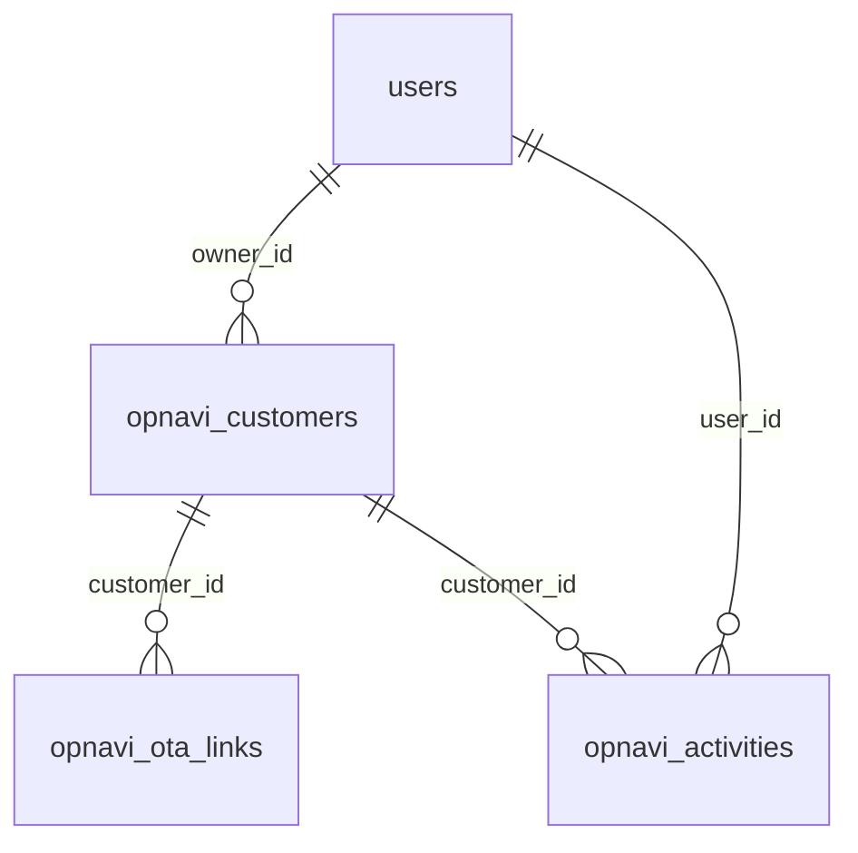

# コキャッチ 技術仕様書

## 1. 概要

本ドキュメントは、オペナビ向け顧客管理機能の技術仕様をまとめたものです。

- 対象サービス: オペナビ
- アプリ名: コキャッチ
- フレームワーク: Laravel 9
- PHP: 8.1
- DB: MySQL 8.0
- ローカル実行: Laravel Sail + Docker Desktop
- 実装ディレクトリ: `app/`
- 要件定義書: `outputs/customer_management_requirements_draft.md`

トップ画面はサービス選択のみを担い、オペナビと送客は別サービスとして扱います。初期版ではオペナビのみ実装し、送客は準備中表示とします。将来の送客機能は、トップだけ共通化し、データ・画面・DBテーブルはサービス別に分ける方針です。

## 2. Laravel 構成

| 種別 | パス | 役割 |
|---|---|---|
| ルーティング | `app/routes/web.php` | トップ、一覧、詳細、CSVインポート、履歴登録などのWebルート |
| コントローラー | `app/app/Http/Controllers/HomeController.php` | トップ画面 |
| コントローラー | `app/app/Http/Controllers/DashboardController.php` | 営業ダッシュボード |
| コントローラー | `app/app/Http/Controllers/CustomerController.php` | 顧客一覧、詳細、更新、削除、CSVインポート、架電・対応履歴のHTTP入出力 |
| FormRequest | `app/app/Http/Requests/CustomerUpdateRequest.php` | 顧客更新バリデーション |
| FormRequest | `app/app/Http/Requests/CustomerImportRequest.php` | CSVインポートバリデーション |
| FormRequest | `app/app/Http/Requests/ActivitySaveRequest.php` | 架電・対応履歴の登録・更新バリデーション |
| サービス | `app/app/Services/Opnavi/CustomerService.php` | 顧客更新時の補完処理 |
| サービス | `app/app/Services/Opnavi/CustomerQueryService.php` | 一覧検索、並び替え、ページネーション、選択肢取得 |
| サービス | `app/app/Services/Opnavi/CustomerImportService.php` | CSV読込、検証、重複判定、OTAリンク解析、保存 |
| サービス | `app/app/Services/Opnavi/CustomerActivityService.php` | 架電・対応履歴の登録・更新・削除、最新履歴からの顧客ステータス同期 |
| モデル | `app/app/Models/Customer.php` | オペナビ顧客 |
| モデル | `app/app/Models/OtaLink.php` | OTAリンク |
| モデル | `app/app/Models/Activity.php` | 架電・対応履歴 |
| モデル | `app/app/Models/User.php` | 担当者ユーザー |
| マイグレーション | `app/database/migrations/*opnavi*.php` | オペナビ用DBテーブル定義 |
| ビュー | `app/resources/views/home.blade.php` | トップ画面 |
| ビュー | `app/resources/views/dashboard.blade.php` | 営業ダッシュボード |
| ビュー | `app/resources/views/customers/index.blade.php` | 顧客一覧 |
| ビュー | `app/resources/views/customers/show.blade.php` | 詳細画面 |
| ビュー | `app/resources/views/customers/_detail.blade.php` | サイドモーダル内の詳細表示 |
| レイアウト | `app/resources/views/components/layouts/app.blade.php` | 共通レイアウト、オペナビ配下のサイドバー |
| ページネーション | `app/resources/views/pagination/default.blade.php` | 一覧のページネーション表示 |
| CSS | `app/public/css/app.css` | 画面スタイル |
| JavaScript | `app/public/js/app.js` | サイドバー、コピー、サイドモーダル、CSVインポートモーダルなどの画面操作 |
| 画像 | `app/public/images/external-link.png` | 別タブ詳細リンクのアイコン |
| CSVテンプレート | `app/public/templates/opnavi_import_template.csv` | インポート用テンプレート |
| Docker | `app/docker-compose.yml` | Sail / MySQL のローカル構成 |
| ローカル手順 | `app/LOCAL_SETUP.md` | 起動・停止・トラブルシュート |

コントローラーはHTTPリクエスト、レスポンス、リダイレクトの調整を主責務とします。CSVインポート、検索条件、履歴同期などの業務ロジックはサービス層へ分離し、バリデーションはFormRequestへ分離します。

Blade内に直接JavaScriptを書かず、画面操作用のJavaScriptは `app/public/js/app.js` に分離します。現時点ではビルドなしで動かせる構成を優先し、Vite管理への移行はnpm環境を整えるタイミングで再検討します。

## 3. ローカル起動方法

初回起動:

```bash
cd app
cp .env.example .env
./vendor/bin/sail up -d
./vendor/bin/sail artisan migrate --seed
```

ブラウザ:

```text
http://localhost:8080
```

停止:

```bash
cd app
./vendor/bin/sail down
```

主な環境変数:

| キー | 値 | 説明 |
|---|---:|---|
| `APP_PORT` | `8080` | ローカルWebポート |
| `FORWARD_DB_PORT` | `3307` | ホスト側MySQLポート |
| `DB_CONNECTION` | `mysql` | DB接続 |
| `DB_HOST` | `mysql` | Docker Compose上のMySQLホスト名 |
| `DB_PORT` | `3306` | コンテナ内MySQLポート |
| `DB_DATABASE` | `opnavi_crm` | DB名 |
| `DB_USERNAME` | `sail` | DBユーザー |
| `DB_PASSWORD` | `password` | DBパスワード |

`opnavi_customers` が存在しないエラーが出た場合は、マイグレーション未実行が原因です。

```bash
cd app
./vendor/bin/sail artisan migrate --seed
```

開発環境でデータを消してよい場合のみ、以下でDBを作り直せます。

```bash
cd app
./vendor/bin/sail artisan migrate:fresh --seed
```

## 4. テスト方針

Laravelのテストは `app/tests` 配下で管理します。

- Unitテスト: 小さな関数やサービス単位の確認
- Featureテスト: HTTPリクエストを通して、画面・フォーム送信・DB更新まで含めた振る舞いを確認

現時点ではFeatureテストを中心に追加しています。これは顧客管理画面の主要操作が、ルート、FormRequest、サービス層、DB保存まで連動しているためです。

テスト実行:

```bash
cd app
php artisan test
```

テスト環境では `phpunit.xml` でSQLiteインメモリDBを使います。本番・ローカル開発用のMySQLデータは汚しません。

追加済みFeatureテスト:

| テスト | 確認内容 |
|---|---|
| `CustomerListTest` | 一覧検索、ステータス絞り込み、当日対応、並び替え、表示件数、一覧上の担当者即保存後に一覧へ戻ること |
| `CustomerListTest` | 電話番号検索でハイフンあり・なし・スペースあり・部分一致ができること |
| `CustomerListTest` | 複数キーワードのAND検索、体験内容をフリーワード検索対象に含めないこと |
| `CustomerListTest` | 別タブ詳細で変更したステータスを一覧側へ反映するためのDOM属性が出力されること |
| `CustomerListTest` | 選択した顧客の担当者を一括更新でき、未選択時はエラーになること |
| `CustomerListTest` | ユーザー画面ではCSVインポート、一括担当者設定、管理用導線が表示されないこと |
| `CustomerListTest` | ユーザー詳細では管理項目の変更や顧客削除が制限され、許可された3項目だけ更新できること |
| `CustomerActivityTest` | 架電・対応履歴登録後に顧客ステータス、最終アクション日、最終メモが同期されること |
| `CustomerImportTest` | CSVインポートで顧客・OTAリンクが作成され、営業日数12日未満の行がスキップされること |

## 5. 画面ルーティング

| メソッド | パス | ルート名 | 処理 | 用途 |
|---|---|---|---|---|
| `GET` | `/` | `home` | `HomeController@index` | トップ画面 |
| `GET` | `/opnavi` | `opnavi` | redirect | オペナビ一覧へ遷移 |
| `GET` | `/opnavi/admin/dashboard` | `dashboard` | `DashboardController@index` | 管理画面: 営業ダッシュボード |
| `GET` | `/opnavi/admin/customers` | `customers.index` | `CustomerController@index` | 管理画面: 顧客一覧 |
| `PATCH` | `/opnavi/admin/customers/bulk-owner` | `customers.bulk-owner` | `CustomerController@bulkUpdateOwner` | 管理画面: 選択顧客の担当者一括設定 |
| `POST` | `/opnavi/admin/customers/import` | `customers.import` | `CustomerController@import` | 管理画面: CSVインポート |
| `GET` | `/opnavi/admin/customers/{customer}` | `customers.show` | `CustomerController@show` | 管理画面: 詳細画面 |
| `PATCH` | `/opnavi/admin/customers/{customer}` | `customers.update` | `CustomerController@update` | 管理画面: 顧客基本情報更新 |
| `DELETE` | `/opnavi/admin/customers/{customer}` | `customers.destroy` | `CustomerController@destroy` | 管理画面: 顧客削除 |
| `POST` | `/opnavi/admin/customers/{customer}/activities` | `customers.activities.store` | `CustomerController@storeActivity` | 管理画面: 架電・対応履歴登録 |
| `PATCH` | `/opnavi/admin/customers/{customer}/activities/{activity}` | `customers.activities.update` | `CustomerController@updateActivity` | 管理画面: 架電・対応履歴更新 |
| `DELETE` | `/opnavi/admin/customers/{customer}/activities/{activity}` | `customers.activities.destroy` | `CustomerController@destroyActivity` | 管理画面: 架電・対応履歴削除 |
| `GET` | `/opnavi/user/customers` | `user.customers.index` | `CustomerController@userIndex` | ユーザー画面: 顧客一覧 |
| `GET` | `/opnavi/user/customers/{customer}` | `user.customers.show` | `CustomerController@userShow` | ユーザー画面: 詳細画面 |
| `PATCH` | `/opnavi/user/customers/{customer}` | `user.customers.update` | `CustomerController@userUpdate` | ユーザー画面: 許可項目更新 |
| `POST` | `/opnavi/user/customers/{customer}/activities` | `user.customers.activities.store` | `CustomerController@userStoreActivity` | ユーザー画面: 架電・対応履歴登録 |
| `PATCH` | `/opnavi/user/customers/{customer}/activities/{activity}` | `user.customers.activities.update` | `CustomerController@userUpdateActivity` | ユーザー画面: 架電・対応履歴更新 |

詳細画面は2つの表示形式があります。

- 管理通常アクセス: `/opnavi/admin/customers/{id}` で詳細画面を1画面表示
- 管理一覧サイドモーダル: `/opnavi/admin/customers/{id}?modal=1` をAjaxで取得し、部分テンプレートを表示
- ユーザー通常アクセス: `/opnavi/user/customers/{id}` で機能制限された詳細画面を1画面表示
- ユーザー一覧サイドモーダル: `/opnavi/user/customers/{id}?modal=1` をAjaxで取得し、部分テンプレートを表示

`?modal=1` が付いていても、Ajaxではない通常アクセスの場合はフルレイアウトで表示します。これにより、履歴登録後などにCSSが当たらない部分HTMLだけの画面へ遷移しないようにしています。

旧URL `/opnavi/customers`、`/opnavi/customers/{customer}`、`/opnavi/dashboard` は、既存ブックマークやローカル確認の互換性を保つため、管理画面URLへリダイレクトします。

ユーザー画面では、認証・権限管理の実装前でも管理画面とURLを分け、画面上の操作も制限します。初期版ではユーザー画面に以下のルートを用意しません。

- 営業ダッシュボード
- CSVインポート
- 事業者名、住所、担当者などの管理項目更新
- 顧客削除
- 担当者一括更新
- 架電・対応履歴削除

ユーザー画面の顧客更新では、`UserCustomerUpdateRequest` を使い、保存対象を `contact_phone`、`next_action_at`、`sales_memo` の3項目に限定します。フォーム上にその他の値が含まれていても、ユーザー画面の更新処理では保存対象にしません。

## 6. DBテーブル

### 5.1 `users`

担当者を管理するテーブルです。初期版ではログイン機能は未実装ですが、担当者選択のために利用します。

| カラム | 型 | NULL | 説明 |
|---|---|---:|---|
| `id` | bigint | no | 主キー |
| `name` | string | no | 担当者名 |
| `email` | string unique | no | メールアドレス |
| `email_verified_at` | timestamp | yes | メール認証日時 |
| `password` | string | no | パスワード |
| `role` | string | no | 権限。初期値 `member` |
| `is_active` | boolean | no | 有効状態。初期値 `true` |
| `remember_token` | string | yes | Laravel標準 |
| `created_at` / `updated_at` | timestamp | yes | 作成・更新日時 |

初期Seederでは、管理者ユーザーとして `管理者` を1件作成します。

### 5.2 `opnavi_customers`

オペナビの事業者を管理するメインテーブルです。管理単位は「事業者」です。

| カラム | 型 | NULL | 説明 |
|---|---|---:|---|
| `id` | bigint | no | システム自動採番ID |
| `registered_at` | date | no | 登録日 |
| `business_name` | string | no | 事業者名 |
| `prefecture` | string | yes | 都道府県推定値。現在は補助項目 |
| `region` | string | no | CSVの「地域」。画面上は「都道府県」として扱う |
| `area_name` | string | no | 店舗 |
| `address` | string | no | 住所 |
| `website_url` | string | yes | Web URL |
| `head_office_phone` | string | yes | 電話番号（本社） |
| `public_phone` | string | yes | 電話番号（OTA公開） |
| `contact_phone` | string | yes | 担当者電話番号 |
| `experience_title` | string | no | 体験内容 |
| `domestic_otas` | string | yes | 国内掲載OTA |
| `ota_count` | unsigned integer | no | 掲載OTA数 |
| `other_ota_names` | string | yes | その他OTA名 |
| `business_scale` | string | yes | 事業者規模 |
| `store_count` | unsigned integer | yes | 店舗数 |
| `monthly_open_days` | unsigned integer | yes | 営業日数(1ヶ月) |
| `request_booking_status` | string | yes | リクエスト予約 |
| `research_notes` | text | yes | 調査メモ |
| `status` | string | no | 顧客ステータス。初期値 `未対応` |
| `priority` | string | yes | 優先度。DBには保持するが初期版の一覧では非表示 |
| `owner_id` | foreignId | yes | 担当者。`users.id` を参照、削除時はNULL |
| `last_action_at` | date | yes | 最終アクション日 |
| `last_action_summary` | string | yes | 最終アクション概要 |
| `next_action_at` | date | yes | 次回アクション日 |
| `next_action_summary` | string | yes | 次回アクション概要 |
| `sales_memo` | text | yes | 営業メモ |
| `deleted_at` | timestamp | yes | 論理削除日時 |
| `created_at` / `updated_at` | timestamp | yes | 作成・更新日時 |

削除は論理削除です。論理削除済みデータは通常の一覧・検索には表示しません。

### 5.3 `opnavi_ota_links`

事業者ごとのOTAリンクを管理します。

| カラム | 型 | NULL | 説明 |
|---|---|---:|---|
| `id` | bigint | no | 主キー |
| `customer_id` | foreignId | no | `opnavi_customers.id` を参照 |
| `ota_name` | string | no | OTA名。例: じゃらん、楽天 |
| `listing_url` | text | no | OTA掲載URL |
| `created_at` / `updated_at` | timestamp | yes | 作成・更新日時 |

`customer_id` は顧客削除時にカスケード削除されます。

### 5.4 `opnavi_activities`

架電・対応履歴を管理します。

| カラム | 型 | NULL | 説明 |
|---|---|---:|---|
| `id` | bigint | no | 主キー |
| `customer_id` | foreignId | no | `opnavi_customers.id` を参照 |
| `user_id` | foreignId | no | 対応した担当者。`users.id` を参照 |
| `action_at` | datetime | no | 対応日時 |
| `contact_person` | string | yes | 相手の担当者 |
| `contact_status` | string | yes | 担当ステータス。`受付`、`担当者`、`代表`、`その他` から選択 |
| `contact_phone` | string | yes | 担当者電話番号。過去互換用として保持し、初期画面では入力しない |
| `status` | string | no | 対応時のステータス |
| `memo` | text | no | メモ |
| `created_at` / `updated_at` | timestamp | yes | 作成・更新日時 |

`customer_id` は顧客削除時にカスケード削除されます。

## 7. リレーション



## 8. インデックス

| テーブル | インデックス | 目的 |
|---|---|---|
| `users` | `email` unique | ログイン・ユーザー一意性 |
| `opnavi_customers` | `business_name`, `address` | CSV重複判定、事業者名+住所での更新判定 |
| `opnavi_customers` | `region`, `owner_id` | 都道府県・担当者の複合絞り込み |
| `opnavi_customers` | `status`, `next_action_at` | ステータス、次回アクション日、期限切れ検索 |
| `opnavi_customers` | `registered_at` | 初期表示の登録日降順ソート |
| `opnavi_customers` | `FULLTEXT business_name, address, sales_memo WITH PARSER ngram` | 顧客一覧のフリーワード検索 |
| `opnavi_activities` | `customer_id`, `action_at` | 顧客ごとの履歴取得、最新履歴判定 |

MySQLでは `opnavi_customers_search_fulltext` を使い、`business_name`、`address`、`sales_memo` に `FULLTEXT INDEX ... WITH PARSER ngram` を設定します。マイグレーションは `app/database/migrations/2026_08_14_000001_add_fulltext_index_to_opnavi_customers_search_columns.php` です。SQLiteテスト環境ではFULLTEXTを作成せず、検索処理側でLIKEへfallbackします。

## 9. CSVインポート仕様

### 8.1 基本

- 入口: 一覧画面のCSVインポートボタン
- エンドポイント: `POST /opnavi/admin/customers/import`
- テンプレート: `app/public/templates/opnavi_import_template.csv`
- 対応形式: CSV / txt
- 文字コード: PHPの `fgetcsv` で読み取り可能なCSVを前提
- 成功時: 一覧へ戻り、画面上部に `〇〇.csvのインポートに成功しました` を表示
- 失敗時: インポートモーダル内にエラーを表示
- モーダルを閉じた場合: エラー表示は消え、再度開いた時は空の状態で表示

### 8.2 必須列

CSVに以下の列が存在しない場合、インポートを停止します。

- `登録日`
- `事業者名`
- `地域`
- `店舗`
- `住所`
- `電話番号（OTA公開）`
- `体験内容`
- `国内掲載OTA`
- `営業日数(1ヶ月)`
- `リクエスト予約`
- `OTA_URL（メイン4社）`
- `ステータス`
- `担当者`

### 8.3 必須値

以下の項目が空の行はエラーにします。

- `登録日`
- `事業者名`
- `地域`
- `店舗`
- `住所`
- `体験内容`
- `国内掲載OTA`
- `営業日数(1ヶ月)`
- `リクエスト予約`

`ステータス` と `担当者` は列としては必要ですが、値は空でも許容します。

### 8.4 スキップ条件

以下の行はエラーにせずスキップします。

- インポート対象項目がすべて空の行
- `営業日数(1ヶ月)` が12日未満の行

営業日数12日未満の行をスキップした場合、成功メッセージに `営業日数12日未満のためN件をスキップしました` を付けます。

### 8.5 重複判定

重複判定キー:

```text
事業者名 + 住所
```

同じ事業者名・住所のデータが既に存在する場合、初回は重複候補としてエラー表示します。更新して取り込む場合は、確認チェックを入れて再実行します。

確認付きで再実行した場合は、既存レコードを更新します。

ただし、既存顧客の `status` はCSVでは更新しません。顧客の現在ステータスは最新の架電・対応履歴から反映する方針のため、CSVの `ステータス` は新規作成時の初期値としてのみ使用します。

### 8.6 列マッピング

| CSV列 | DBカラム | 備考 |
|---|---|---|
| `登録日` | `registered_at` | `Y/m/d`、`Y-m-d`、`Y.n.j`、`Y年n月j日` などを正規化 |
| `事業者名` | `business_name` | 重複判定にも使用 |
| `地域` | `region` | 画面では都道府県として表示 |
| `地域` または `住所` | `prefecture` | 正規表現で都道府県を推定 |
| `店舗` | `area_name` |  |
| `住所` | `address` | 重複判定にも使用 |
| `HP_URL` / `Web_URL` / `web_URL` | `website_url` | 存在する列を利用 |
| `電話番号（本社）` | `head_office_phone` | 任意 |
| `電話番号（OTA公開）` | `public_phone` | 列は必須、値は現在任意 |
| `体験内容` | `experience_title` | 旧称「体験名」ではなく「体験内容」 |
| `国内掲載OTA` | `domestic_otas` | OTA数計算にも利用 |
| `OTA_URL（メイン4社）` | `opnavi_ota_links` | OTA名とURLに分解 |
| `店舗数` | `store_count` | 数字のみ抽出。空欄の場合は `null` |
| `営業日数(1ヶ月)` | `monthly_open_days` | 数字のみ抽出 |
| `リクエスト予約` | `request_booking_status` |  |
| `ステータス` | `status` | 新規作成時のみ使用。空または不正値の場合は `未対応`。既存顧客の重複更新時は現在ステータスを保持 |
| `担当者` | `owner_id` | 名前から `users` を検索・作成 |

CSVの `No`、`メモ` はインポート対象外です。

### 8.7 OTA URL解析

`OTA_URL（メイン4社）` は行単位で解析します。

対応形式:

```text
じゃらん: https://example.com/...
楽天：https://example.com/...
```

`:` または `：` の前をOTA名、後ろの `https://` から始まる文字列をURLとして保存します。

### 8.8 CSVヘッダー重複への対応

同名ヘッダーがCSV内に複数ある場合は、先に出現した列を採用し、後続の同名列は無視します。これは、点数列などにより同名ヘッダーが重複した場合に、本来の取り込み対象列が上書きされることを防ぐためです。

## 10. 一覧画面仕様

主な機能:

- キーワード検索
- ステータス絞り込み
- 当日対応絞り込み
- 列ヘッダーによる並び替え
- 表示件数切り替え: 25件 / 50件 / 100件
- CSVインポート
- 事業者名クリックでサイドモーダル詳細
- 事業者名横のアイコンで別タブ詳細
- ステータス、担当者、次回アクション日の確認
- チェックボックスで選択した顧客への担当者一括設定

初期表示:

- 並び替え: 次回アクション日
- 順序: 近い順 / 昇順
- 次回アクション日が未設定の顧客は末尾に表示

検索エリア:

- `当日対応` ボタン
- `ステータス`
- `事業者名・電話番号・住所・営業メモ` のフリーワード入力
- `検索` ボタン
- `条件をクリア` ボタン

`当日対応` ボタンは、他の検索条件の影響を受けず、`today_action=1` のみを付けて次回アクション日が当日の顧客に絞り込みます。

表示件数は検索フォーム内ではなく、検索フォームとテーブルの間の右側に配置します。画面上は `25件`、`50件`、`100件` のセレクトのみを表示し、アクセシビリティ用に `aria-label="表示件数"` を付けます。表示件数変更時は、現在の検索条件と有効なソート条件を維持し、ページ番号はリセットします。

ユーザーが検索条件・並び替え条件を指定した場合は、クエリ文字列で保持します。CSVインポート後も検索条件は維持します。

フリーワード検索対象:

- `business_name`
- `address`
- `sales_memo`
- `head_office_phone`
- `public_phone`
- `contact_phone`

`experience_title`、`region`、`area_name` はフリーワード検索対象に含めません。

MySQLでは、2文字以上の通常キーワードに対して `MATCH (business_name, address, sales_memo) AGAINST (? IN BOOLEAN MODE)` を使います。検索語は `+"キーワード"` の形式で渡し、ngramの一部分だけが一致したレコードではなく、入力した検索語そのものが連続した文字列として存在するレコードをヒットさせます。スペース区切りで複数キーワードが入力された場合は、キーワードごとにAND検索します。

1文字キーワード、およびSQLiteテスト環境では、`business_name`、`address`、`sales_memo` に対してLIKE検索へfallbackします。

電話番号3項目はFULLTEXT検索に含めず、LIKE検索を使います。検索時は入力値から数字以外を除去し、DB側も `-`、半角スペース、全角スペース、括弧を除去して比較します。これにより、DBに `050-7109-1331` と保存されている場合でも、`050-7109-1331`、`05071091331`、`050 7109 1331`、`7109`、`71091331` で検索できます。

並び替え:

- `掲載OTA数`
- `最終アクション`
- `次回アクション`

上記3列は列名全体をソートボタンとして扱います。クリックするたびに `昇順`、`降順`、`デフォルト順` の順に切り替えます。ソート可能列には未選択時も `↑↓` を表示し、現在の昇順は `↑`、降順は `↓` を表示します。ソートリンクは通常の画面リロードではなく、JavaScriptで一覧部分を更新できる場合は非同期に取得して差し替えます。

一覧の表示列は可読性を優先します。優先度列は初期版では非表示です。DBカラムは残しているため、将来的に必要になった場合は画面に戻せます。

## 11. 詳細画面仕様

詳細画面では以下を扱います。

- 基本情報の表示・編集
- 電話番号（本社）のコピー
- 電話番号（OTA公開）のコピー
- 担当者電話番号
- ステータス表示
- 担当者
- 次回アクション日
- 営業メモ
- 体験・OTA情報
- OTA名リンク
- Webサイトリンク
- 架電・対応履歴の登録・既存履歴更新
- 論理削除
- 前後の事業者詳細への移動

電話番号コピー時は `コピーしました` の通知を表示します。外部リンクは別タブで開きます。

Web URLは入力欄の横に `Webサイトを開く` リンクを表示し、登録日 は基本情報の先頭ではなく後半に配置します。

`戻る`、`次へ` ボタンは一覧画面から引き継いだ検索条件・並び替え条件に基づく前後の顧客を対象にします。サイドモーダル内ではAjaxで詳細本文のみを切り替え、通常の詳細画面ではページ遷移します。

架電・対応履歴の新規登録フォームでは、詳細画面またはサイドモーダルを開いた時点の端末ローカル日時を `日時` に自動入力します。

日付入力・日時入力:

- 一覧画面の `次回アクション日` は独自のカレンダーUIで選択します。
- 詳細画面の `次回アクション日` と `登録日` は独自のカレンダーUIで選択します。
- 架電・対応履歴の `日時` は日付と時刻を選択できる独自の日時カレンダーUIで選択します。
- カレンダーアイコンには `app/public/images/calendar.png` を使います。
- 月移動ボタンを押しても入力値は変更しません。日付をクリックして選択した時点で入力値を更新します。
- カレンダーは表示位置を開いた時点の入力欄に合わせます。画面スクロール時に入力欄から離れて追従し続けないようにします。
- 日付カレンダーの `今日` は本日の日付を反映します。
- 日時カレンダーの `現在日時` は現在の日付と時刻を入力値に反映し、カレンダーを閉じます。
- 架電・対応履歴が存在しない場合でも、日時カレンダーや履歴フォームが画面外で見切れないよう、履歴エリアの余白と配置を調整します。

一覧サイドモーダル内でフォームに未保存の変更がある場合、閉じる操作時に確認ダイアログを表示します。

一覧サイドモーダル内の保存・履歴登録・履歴更新フォームはAjaxで送信し、DB保存処理が完了した後に成功通知を表示します。保存後も詳細画面へ遷移せず、サイドモーダル本文だけを再読み込みします。HTTPエラーやバリデーションエラーなど保存が完了しなかった場合は、成功通知ではなくサイドモーダル内に失敗通知を表示します。

複数タブ操作では、同じ顧客を複数タブで編集した場合は最後に保存された内容を反映します。ただし、別タブで顧客が削除済みになった後に詳細表示・保存・履歴登録を行った場合は保存せず、通常画面では一覧へ戻してエラー通知を表示し、サイドモーダルではモーダル内にエラー通知を表示します。

削除時は確認モーダルを表示し、実行時は論理削除します。初期版では復元画面は作りません。

## 12. ステータスと架電・対応履歴の同期

利用するステータス:

- `未対応`
- `連絡済み`
- `やり取り中`
- `アポイント`
- `商談中`
- `契約`
- `失注`

顧客の現在ステータスは `opnavi_customers.status` に保持します。

架電・対応履歴を登録、既存履歴を更新、または履歴を削除した場合、最新の履歴を基準に顧客情報へ同期します。

同期対象:

- `status`: 最新履歴のステータス
- `last_action_at`: 最新履歴の対応日
- `last_action_summary`: 最新履歴メモの先頭80文字

最新履歴の判定:

```text
action_at desc, id desc
```

一覧画面・詳細画面のステータスは、この顧客ステータスを参照します。ステータスを履歴と一貫させるため、ステータス変更は架電・対応履歴の登録または既存履歴の編集を通じて行います。登録済み履歴では担当者、担当ステータス、ステータス、メモを更新できます。

別タブ同期:

- 詳細画面またはサイドモーダルでDB保存が成功した後、現在の顧客IDと最新ステータスを一覧タブへ通知します。
- 対応ブラウザでは `BroadcastChannel` を使い、チャンネル名は `opnavi-customer-status` とします。
- `BroadcastChannel` に対応しないブラウザ向けに、`localStorage` のstorageイベントをfallbackとして使います。
- 一覧画面は `data-customer-row`、`data-customer-status-pill` を使って対象行を特定し、該当行のステータス表示だけを即時更新します。
- 詳細画面側は `data-current-customer-status` と `data-customer-id` を持ち、保存後に現在ステータス表示を更新します。

履歴削除後に履歴が1件も残っていない場合は、顧客ステータスを `未対応` に戻し、`last_action_at` と `last_action_summary` を空にします。

ステータス表示は `status-pill` で色分けします。

| ステータス | CSSクラス | 背景 | 枠線 | 文字 |
|---|---|---|---|---|
| 未対応 | `status-pill--not-started` | `#f1f5f9` | `#cbd5e1` | `#334155` |
| 連絡済み | `status-pill--contacted` | `#dbeafe` | `#93c5fd` | `#1d4ed8` |
| やり取り中 | `status-pill--in-progress` | `#cffafe` | `#67e8f9` | `#0e7490` |
| アポイント | `status-pill--appointment` | `#fef3c7` | `#fcd34d` | `#92400e` |
| 商談中 | `status-pill--negotiation` | `#ede9fe` | `#c4b5fd` | `#6d28d9` |
| 契約 | `status-pill--contracted` | `#dcfce7` | `#86efac` | `#166534` |
| 失注 | `status-pill--lost` | `#fee2e2` | `#fca5a5` | `#b91c1c` |

## 13. 営業ダッシュボード

営業ダッシュボードでは以下の指標を表示します。

| 指標 | 意味 |
|---|---|
| 総顧客数 | 登録されている事業者数 |
| 未対応件数 | ステータスが未対応の件数 |
| 本日対応件数 | 次回アクション日が今日の件数 |
| 期限切れ件数 | 次回アクション日が過去の件数 |
| 未担当件数 | 担当者が未設定の件数 |
| 契約件数 | ステータスが契約の件数 |
| 失注件数 | ステータスが失注の件数 |

## 14. セキュリティ・運用方針

初期版ではログイン機能は未実装です。ローカル確認を優先し、開発用の固定ユーザーを担当者として利用します。実運用前にはログイン機能を追加する前提です。

DBに顧客情報・電話番号を保存するため、実運用時は以下を前提にします。

- 本番環境ではHTTPSを利用する
- `.env` はGit管理しない
- 本番DBのユーザー権限を必要最小限にする
- 本番DBパスワードは開発環境と分ける
- バックアップファイルの保管場所と閲覧権限を制限する
- 画面アクセスにはログイン機能を導入する

暗号化については、初期版ではアプリケーションレベルのカラム暗号化は未実装です。電話番号などの秘匿性をさらに高める場合は、Laravelの暗号化キャストまたは独自暗号化を検討します。ただし、検索・CSV更新・重複判定との相性があるため、対象カラムを決めてから設計します。

## 15. バックアップ方針

方針:

- 日次バックアップ
- CSVインポート前の手動バックアップ
- 運用前に復元テストを実施

初期版では復元画面は実装しません。復元はDBバックアップから管理者が実施する想定です。

## 16. 今後の検討事項

- ログイン機能、権限管理
- 本番環境へのデプロイ手順
- エックスサーバー利用時の構成
- 電話番号など個人情報カラムの暗号化
- CSV重複時に上書きする項目の細分化
- CSVエクスポート
- 削除済みデータの復元画面
- 送客サービス側のDB・画面設計
- 優先度項目を再度使うかどうか
- バックアップ自動化と復元手順書
